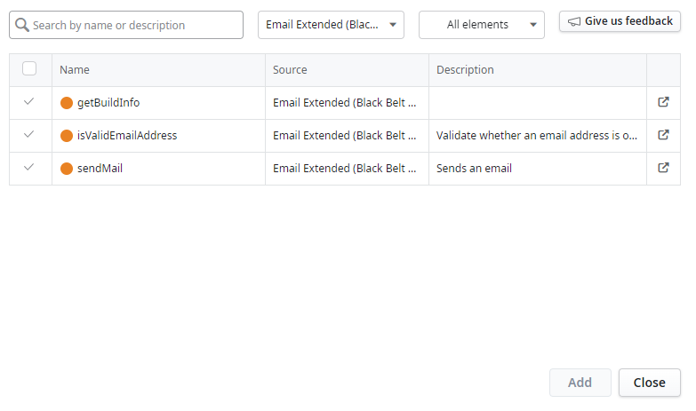
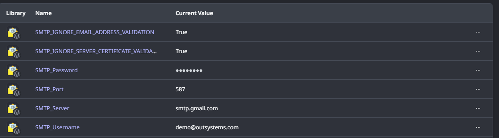

# Email Extended (Black Belt Edition)

## Introduction

ODC has the capability to send [templated emails] (https://success.outsystems.com/documentation/outsystems_developer_cloud/building_apps/emails/working_with_emails/) out. The templates are prepared at design time and during runtime, we merely supply tokens to be replaced in the email template, supply the recipients' information and viola! We would have wished that the story ended as "And they lived happily ever after", but sometimes it does not end that way.

## A twist of fate
So, we do have a case where a customer is having an WYSWYG editor on an admin portal that does all the design of email template -yup, they are not designing it within ODC studio! The template is saved in the database and at runtime, the template is retrieved, tokens are replaced with runtime values. 

When the customer pass in the token-replaced content to ODC email facility, the content is rendered as text (not html - which the customer is designing). All the HTML tags shows up and the mail is not rendered properly.

In this article, we will explore the Email Extended (Black Belt Edition) library. It is a wrapper around the Email Extended custom library. There is also a similar O11 counterpart found [here](https://www.outsystems.com/forge/component-overview/10575).

*It might be also delightful to bring to you attention that in addition to validating emails that conforms to RFC 6530. So, if the SMTP server supports RFC 6530, you should able to include email address that fully support internationalized email addresses. Starting from build number 20240723141911, email address validation is optional and can be turned off through a setting. See below for more information.*
 

## Pre-requisites

To use this component correctly, you should have:

1. A valid set of SMTP credentials for you to send off emails, SMTP hostname and port number (TLS supported)
2. SMTP server must support TLS (non-TLS communication is not supported by this forge component)

## Installation

You can install the connector through [ODC Forge](https://success.outsystems.com/documentation/outsystems_developer_cloud/forge/install_or_update_a_forge_asset/#install-a-forge-asset).

You should install the Email Extended (Black Belt Edition) library. The Email_Ext custom code library is a dependent and will be installed together with Email Extended (Black Belt Edition) library.

## How to Use

### Add library to your application

To use Email Extended (Black Belt Edition), simply add dependency of this library to your application.

Depending whether you want to use all the APIs, you can selectively add the needed APIs (or removed unused ones automatically later).

### Configuration

The _Email Extended (Black Belt Edition)_ library requires a few settings to be configured in ODC portal for your application which is using the library:

| S/No. | Name of setting | Remarks                                                                  |
| ----- | --------------- | ------------------------------------------------------------------------ |
| 1.    | SMTP_Server   | SMTP server hostname                        |
| 2.    | SMTP_Port   | SMTP server port that supports TLS                       |
| 3.    | SMTP_Username  | SMTP user ID  |
| 4.    | SMTP_Password | SMTP user password   |
| 5.    | SMTP_IGNORE_EMAIL_ADDRESS_VALIDATION  | True (if email address validation to be ignored). Default is False.  |
| 6.    | SMTP_IGNORE_SERVER_CERTIFICATE_VALIDATION  | False (if server certificate validation is required). Default is True which means server certificate validation is ignore.  |

 

## Found a bug?

Kindly submit your bug report [here](https://github.com/PaulHoOutsystems/email_extended/issues) and do indicate the build number of the library which you are using too.

## Contact

You can reach out to me via email at paul.ho@outsystems.com
